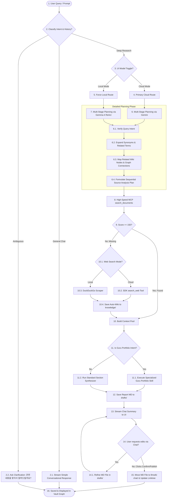
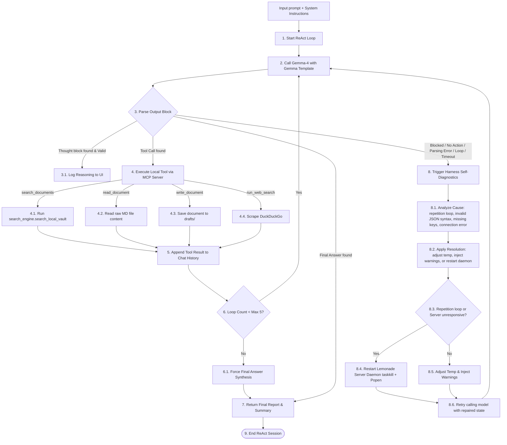

# Harness Flow & Implementation Plan: Advanced Agentic Wiki System

This document specifies the revised agentic architecture of the LLM Wiki & Chat system, incorporating:
1. **MCP Server Integration** for high-speed local document scanning and RAG.
2. **Draft-to-Publish Workflow** (Temporary Draft folder -> Chat Refinement -> Confirm/Publish button -> permanent `llmwiki chat/` vault folder).
3. **UI Toggle Switch** to manually force Cloud (Gemini 2.0) vs. Local (Gemma-4).
4. **Contextual Intent Classification (Step 0)** (Routing general conversational chat vs. deep RAG research vs. ambiguous prompt clarification).
5. **Multi-Stage Graph Traversal Planning Agent** (Intent verification, synonym expansion, node connection mapping, and sequential source analysis).
6. **Specialized Guru Portfolio Synthesis Skill** (Structured pipeline for Guru-specific screening, profile retrieval, and allocation templates).
7. **Gemma-4 Advanced Agentic Harness with Self-Healing ReAct Loop** (Reasoning + Tool/Skill Calling + Diagnostic Error Recovery).

---

## 1. Flowchart A: Overall System Flowchart (Unified Workflow)

This flowchart shows the general lifecycle of a request, from user input and intent classification to RAG search, draft generation, chat refinement, and final publishing.



---

## 2. Flowchart B: Local Model (Gemma-4) Agentic Harness Flowchart (Self-Healing ReAct Loop)

This flowchart details how the **Gemma-4-26B** local model executes reasoning and tools dynamically, with a diagnostic error recovery and self-healing loop.



---

## 3. Advanced Planning & Traversal Specifications

To prevent search dispersion (especially on the local Gemma-4 model), the planning agent is structured with the following JSON schema input and validation loop:

### Planning Schema
```json
{
  "query_intent": "구루 포트폴리오 분석 / 개념 정의 / 최신 동향 조사",
  "core_concepts": ["워런 버핏", "자산 배분", "가치투자"],
  "synonyms": ["Warren Buffett", "버핏 포트폴리오", "Buffett 13F"],
  "connected_nodes": ["Warren Buffett-soul", "Warren Buffett-workflow", "AAPL", "company_financials"],
  "plan_sequence": [
    "1. [[Warren Buffett-soul]] 및 [[Warren Buffett-workflow]] 지식 노드를 읽고 투자 원칙 수립",
    "2. company_financials.json 및 snp500 report/ 에서 포트폴리오 후보군 스크리닝",
    "3. 구글 검색을 통해 실시간 주가 및 주요 리스크 요인 획득",
    "4. 최종 마크다운 보고서 합성 및 임시 파일 작성"
  ]
}
```

---

## 4. Specialized Guru Portfolio Synthesis Skill Pipeline

Since portfolio recommendation is the most frequent query, we implement a highly structured execution pipeline for this skill:

```
[User Request] -> [Detect Guru Name]
       │
       ▼ (Step 1: Retrieve Rules)
Read [G:\내 드라이브\agent-guru\agent-guru\guru report\<GuruName>\]
  ├── <GuruName>-soul.md (Tone, character, investment mindset)
  └── <GuruName>-workflow.md (Mathematical screening rules, constraints)
       │
       ▼ (Step 2: Database Screening)
Execute screen_companies(<GuruName>)
  └── Queries company_financials.json to extract the top 5 qualifying stocks.
       │
       ▼ (Step 3: Real-Time Verification)
Call search_web for live market price & 13F news for the top 3 tickers.
       │
       ▼ (Step 4: Template Output Synthesis)
Enforce standard Markdown output format:
  1. YAML Frontmatter (tags, related concepts, created_at)
  2. Guru Quote (philosophical intro matching the persona)
  3. Asset Allocation Table (Cash %, Stock Ticker Allocations)
  4. Core Investment Rationale (linking back to -workflow rules)
  5. Risk Mitigation Warning (current market threats)
```

---

## 5. Attached Tools Scheme

The agentic harness attaches the following local and cloud-based tools directly to the models:

### A. Document & Knowledge Tools (Exposed via MCP Server)
- **`list_documents`**: Scans the vault to list all markdown pages, allowing the model to know what concepts are already defined.
- **`search_documents(query)`**: Performs a token-and-synonym-expanded search on the Obsidian local vault.
- **`read_document(path)`**: Retrieves the raw content of any wiki page, enabling the model to extract statistics or context.
- **`write_document(title, content)`**: Saves or updates a draft markdown document inside the `knowledge/drafts/` folder.
- **`publish_document(draft_path)`**: Moves the file from `knowledge/drafts/` to `llmwiki chat/` and registers it in `linktree.md`.

### B. Search & Analytics Tools
- **`search_web(query)`**:
  - *Cloud mode*: Calls the native Antigravity SDK Google search tool (`search_web`).
  - *Local mode*: Calls the local DuckDuckGo scraper tool.
  - Used to fetch today's stock price, latest news, and current macro trends.
- **`screen_companies(guru_name)`**:
  - Connects to the local `company_financials.json` database.
  - Returns the top 5 companies matching the financial filters of the chosen Guru (e.g. ROE, operating margin, debt-to-equity, ROC/EY).
- **`get_company_report_context(ticker)`**:
  - Reads detailed company profiles from `snp500 report/`.

---

## 6. Detailed Work Plan

### Step 1: Backend API Additions
- **Drafts Folder Setup**: Configure `agent_harness.py` to write generated reports to `G:\내 드라이브\agent-guru\agent-guru\knowledge\drafts\`.
- **Toggle Parameter**: Update the `/api/chat` POST endpoint in `main.py` to accept `model_mode` (`"cloud"` or `"local"`).
- **Publish Endpoint**: Add a new API endpoint POST `/api/documents/publish` which:
  - Takes `draft_path` as input.
  - Moves the file from `knowledge/drafts/` to `llmwiki chat/`.
  - Generates/updates a `linktree.md` index file inside the vault.
  - Forces a cache refresh in `search_engine`.

### Step 2: MCP Integration
- Integrate the stdio JSON-RPC MCP server (`backend/mcp_server.py`) into the RAG execution pipeline.
- For local model execution, we will route tool calling directly through the MCP functions (`search_documents`, `read_document`, `write_document`) to ensure high-speed processing and clean data separation.

### Step 3: Local Model Gemma-4 ReAct Harness with Self-Healing
- Implement the ReAct loop in `local_llm.py`:
  - Detect and parse `<thought>` tags and JSON tool calls.
  - Bind these parsed calls to the MCP tools.
  - Map Gemma-4 prompt templates.
  - **Self-Healing Diagnostics**: Wrap the Gemma-4 API call in a `try...except` and diagnostic loop. If a token generation block, timeout, repetition loop, or connection error is detected, analyze the cause, apply appropriate resolution (adjusting temperature/prompts, or restarting `LemonadeServer.exe` daemon using taskkill + Popen), and retry the execution.

### Step 4: Frontend UI Enhancements
- **Model Toggle Switch**: Add a clean HSL-styled toggle switch in the Chat header to select between "Cloud Gemini 2.0" and "Local Gemma-4".
- **Publish Button**:
  - Show a prominent "Confirm & Publish (발행 및 저장)" button in the document preview panel if the active file is in the `drafts/` folder.
  - Trigger `/api/documents/publish` on click, then refresh the document details and the graph.
- **Chat Iteration**: Ensure that follow-up chat messages refine the active draft in the temporary folder instead of creating a new report file every time.
